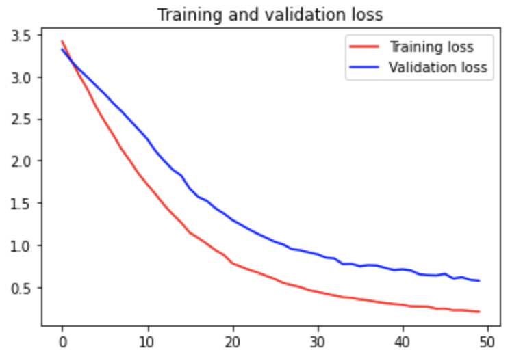
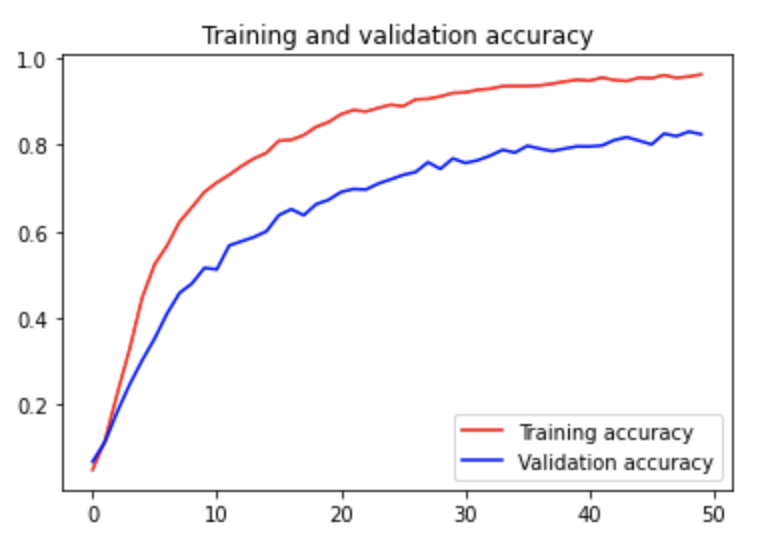

# ASL-Recognizer

This repo contains code to perform automatic static American Sign Language recognition. This was created as part of Option B for the final project for [05-318: Human-AI Interaction](https://haiicmu.github.io/). The motivation stems from the fact that there exists a large communication barrier between deaf and hearing people, and the only way to mitigate it currently is through human interpreters (who are expensive and require human expertise) and handwriting (which is slow and impersonal). The goal of automatic ASL recognition is to get the human-level expertise at no cost, while maintaining human interaction. My project specifically focuses on the real-time detection and recognition of finger-spelling in ASL, which is used for spelling out names, addresses, and any proper nouns. 

## Files Included

* data 
  * Repo containing data files used for training and testing models. Data found from [Kaggle ASL Alphabet dataset](https://www.kaggle.com/grassknoted/asl-alphabet).
* construct_models
  * Repo containing Python notebooks to run to create and save models used in application. Did not include trained models because they were too large to store on Github (requires Git LFS).
* classes.txt
  * File to enumerate all the classes that the model trained on - used for prediction. 
* asl_recognizer_gui.py
  * Python file to run application. Loads model created by American_Sign_Language_Recognition.ipynb and allows user to detect characters in real-time. 
* README.md
* images
  * Repo for images in README.
* requirements.txt
  * Python packages that need to be installed. 

## Installation & Running Code

1. In order to run this code, create a [virtual environment](https://docs.python.org/3/library/venv.html) and run the following in your virtual environment:
```bash
  pip install -r requirements.txt
```
This will install all packages and configure necessary dependencies needed for the code.
2. Since the model was too big to upload to Github, first train the model (approx. 12 hours on my CPU) and save it by running the cells in American_Sign_Language_Recognition.ipynb. The first few cells about downloading the data from Kaggle are not necessary since the data has already been downloaded.
3. Once the model has been saved, run the following:
```bash
python3 asl_recognizer_gui.py
```

## Application

### Model

Initially, I trained the model on the [VGG16](https://arxiv.org/pdf/1409.1556.pdf) model architecture, but the results were not super accurate (~40.09% accuracy). The final model was trained on [Google's Inception-v3](https://arxiv.org/pdf/1512.00567.pdf) model, which is a convolutional neural network used in image analysis, objection detection, and object classification. 


The model was trained on a Kaggle dataset of 87,000 images. There are 29 classes: 26 letters and space, delete, and blank. It uses transfer learning with data augmentation - the augmentation included cropping the images differently, changing the zoom and lighting. The Python notebook used to train the model was found in [this Github](https://github.com/VedantMistry13/American-Sign-Language-Recognition-using-Deep-Neural-Network/blob/master/American_Sign_Language_Recognition.ipynb) repo. The overall accuracy of this model was much higher (~96.43% test accuracy). The following is the results of training the model over 50 epochs.

<div class="row">
    <div class="column">
        
    </div>
    <div class="column">
    
    </div>
</div>

### GUI

Although the model used was from a pre-trained architecture, I created a user interface for users to more easily interact with the the application. The GUI was created using [PySimpleGUI](https://pysimplegui.readthedocs.io/en/latest/). The interface contains a screen for the real-time feed, as well as a Delete and Speech button for the users to make quick corrections to the results. I used [OpenCV](https://opencv.org/) to capture the images using the live stream and cropped the frame to only include the rectangle containing the sign. Then, image needed to be resized to the shape of the training images so that it could more accurately predict the letter that is being signed. Since several letters have extremely similar signs (i.e. H and G, E and S, J and L, etc.), I performed some debouncing by only recording a specific letter if it was detected for several frames in a row to decrease the model's sensitivity. I used [Google's Text-to-Speech engine](https://gtts.readthedocs.io/en/latest/#) to convert the text into an audio file (labelled speech.mp3) and have the application play it out loud. 

### Design Considerations

The idea of using deep learning techniques to develop tools for ASL is new and has been introduced in the past 2-3 years (starting around 2019). Currently, research and development has been done to improve the results of gesture recognition of static ASL letters, but work on phrases and dynamic gestures have still yet to be done. Since the work is so new, the current model still makes mistakes, so it was important for the users to see what the model was recognizing and be able to correct it, as indicated by the [Guidelines for Human-AI Interaction](https://www.microsoft.com/en-us/research/project/guidelines-for-human-ai-interaction/). Some of the guidelines are to "Support efficient dismissal" and "Support efficient correction", which is why the Delete button is extremely accessible and the user can hit the red X to exit the app at any time. In addition, in order to "Make clear why the system did what it did", as the model is predicting a certain letter, I displayed the likelihood of the predicted letter so the user knows how confident the system actually is. 